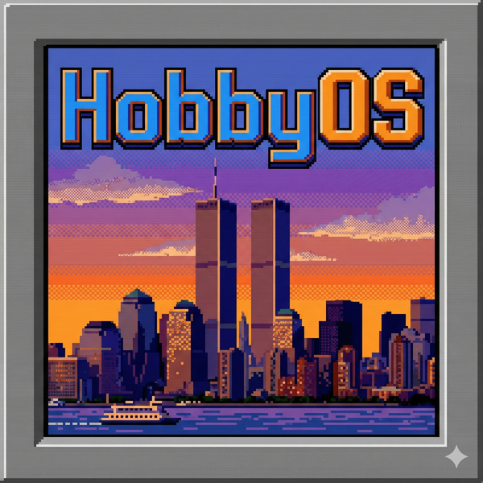
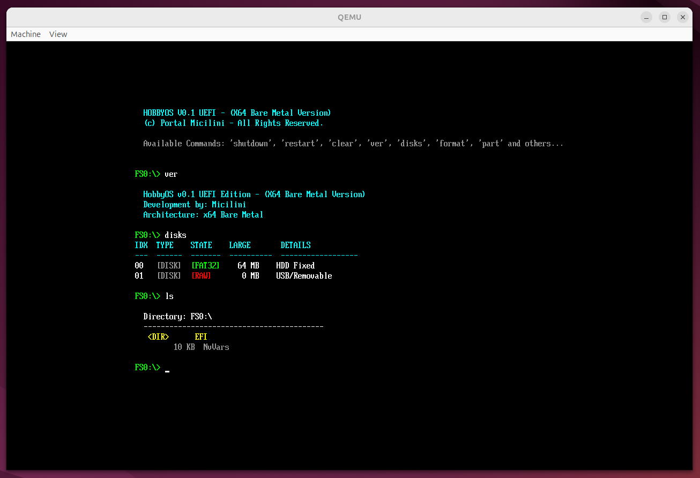

<div align="center">
  
  <h1>HobbyOS</h1>
  <p><strong>A UEFI Bare Metal Pre-OS Environment built from scratch in C.</strong></p>
</div>

---

## 📖 Introduction

**HobbyOS** is a lightweight, educational **UEFI Operating System (Pre-OS)** developed to explore the fundamentals of low-level system programming, file system management, and direct hardware interaction without the aid of a standard operating system kernel (like Linux or Windows).

Running directly on **Bare Metal x64 architecture**, HobbyOS interfaces directly with the UEFI firmware. It features a custom shell, a functional text editor, a complete disk management suite (partitioning, formatting, installation), and a visual interface. 

> **Note:** This project is an educational exploration (a "Hobby OS") designed to demonstrate how UEFI applications work under the hood. It is not intended to replace daily driver operating systems, but rather to serve as a learning platform for system architecture.

---

<div align="center">
  
</div>

---

## 🛠️ Prerequisites & Dependencies

To build and run HobbyOS, you will need a **Linux** environment (Ubuntu/Debian recommended) with the following tools installed:

* **GCC**: The GNU Compiler Collection.
* **GNU-EFI**: The library used to interface with UEFI services.
* **MTools**: Utilities to access MS-DOS disks (needed to generate the `.img` file).
* **QEMU**: To emulate the OS without needing physical hardware.

If you want to test HobbyOS on Physical Hardware you can do it without **QEMU**.

### Install dependencies (Ubuntu/Debian):

```bash
sudo apt-get update
sudo apt-get install build-essential gnu-efi mtools qemu-system-x86
```

---

## 🚀 Building & Running

1. Clone the Repository

```bash
git clone [https://github.com/yourusername/hobby-os.git](https://github.com/yourusername/hobby-os.git)
cd hobby-os
```

2. Clean and Build

Use the provided **makefile** to compile the source code and generate the disk image.

```bash
# Clean previous builds
make clean

# Compile the project and create hobbyos.img
make all
```

3. Run in QEMU

To test the OS immediately in an emulator:

```bash
make run
```

---

## 💾 Running on Real Hardware

HobbyOS is compatible with modern x64 PCs that support **UEFI Boot**.

1. Format a USB Pen Drive to **FAT32**.

2. Inside the ```hobby-os``` folder (after running ```make```), locate the generated ```main.efi``` file.

3. Create the following folder structure on your USB drive: ```/EFI/BOOT/```.

4. Rename ```main.efi``` to ```BOOTX64.EFI``` and copy it into that folder.

5. Path should be: ```USB_ROOT/EFI/BOOT/BOOTX64.EFI```

6. Copy ```logo.bmp``` to the same folder if you want the splash screen.

7. Reboot your PC, enter the BIOS/Boot Menu, and select the USB drive (UEFI mode).

---

## 💻 Command Reference

HobbyOS features a custom shell with history support. Below is the list of available commands:

## 📟 Available Commands

**System & Navigation**

| **Command** | **Arguments**        | **Description** |
|------------|----------------------|-----------------|
| **ls** / **dir** | `-` | Lists files and directories in the current path. |
| **cd** | `<folder>` or `..` | Changes directory. Use `..` to go back. |
| **pwd** | `-` | Prints the current working directory. |
| **vol** | `[id]` | Lists available volumes (`FS0`, `FS1`) or mounts one if an ID is provided. |
| **ver** | `-` | Displays system version and architecture info. |
| **date** | `-` | Shows current RTC date and time. |
| **mem** | `-` | Displays total and free RAM (UEFI Memory Map). |
| **shutdown** | `-` | Safely powers off the machine. |
| **restart** | `-` | Reboots the system. |
| **clear** | `-` | Clears the terminal screen. |

**File Operations**

| **Command** | **Arguments** | **Description** |
|------------|---------------|-----------------|
| **edit** | `<filename>` | Opens the built-in **Visual Text Editor**. <br> <kbd>Ctrl</kbd> + <kbd>C</kbd> to **Save**, <kbd>Ctrl</kbd> + <kbd>X</kbd> to **Exit**. |
| **cat** | `<filename>` | Displays the contents of a text file. |
| **mkdir** | `<name>` | Creates a new directory. |
| **touch** | `<filename>` | Creates a new empty file. |
| **rm** | `<name> [-r]` | Deletes a file. Use the **`-r`** flag for recursive directory deletion. |
| **cp** | `<src> <dst>` | Copies a file from source to destination. |
| **hexdump** | `<filename>` | View the binary content of a file in hexadecimal format. |

**Disk & Installation Tools**

> ⚠️ **Warning:** These commands can **modify or wipe disks**. Use with caution.

| **Command** | **Arguments** | **Description** |
|------------|---------------|-----------------|
| **disks** | `-` | **"X-Ray" view** of connected block devices, showing **size**, **type**, and **partition tables**. |
| **gptinit** | `<disk_idx>` | **Wipes the disk** and initializes a fresh **GPT header** with a **Protective MBR**. |
| **part** | `<disk> <LBA> <MB>` | Creates a new partition on the specified disk. |
| **format** | `<disk> <part> [fast/full]` | Formats a partition to **FAT32**. Default mode is **fast**. |
| **install** | `<disk> <part>` | Installs the **HobbyOS system files** onto the target partition. |

---

## 💿 Installation Guide (Booting from Drive A to Drive B)

HobbyOS includes a complete installer suite capable of partitioning and formatting drives.

> ⚠️ **Warning:** These commands modify your hard drive. Data loss is permanent. Use with caution.

**Step 1: Identify Drives**

Run ```disks``` to see the list of connected drives. Identify the target disk index (e.g., `1`).

**Step 2: Initialize GPT**

If the disk is empty or raw, create the partition table:

```bash
gptinit 1
```

**Step 3: Create a Partition**

Create a partition starting at LBA 2048 (standard alignment) with a size of 500MB:

```bash
part 1 2048 500
```

**Step 4: Format as FAT32**

Format disk `1`, partition `0` (the first partition) using the `fast` method:

```bash
format 1 0 fast
```

Note: You must **reboot** your computer or re-plug the drive if the UEFI firmware doesn't refresh the file system handle immediately.

**Step 5: Install System**

Copies ```BOOTX64.EFI``` and necessary system files to the new drive:

```bash
install 1 0
```

Once finished, you can remove the USB and boot from the newly installed drive.

---

## 🤝 Contributing

Contributions are welcome! If you want to add features like a new file system driver, improve the text editor, or add a game (like the DOOM folder structure suggests):

1. Fork the project.

2. Create your feature branch (`git checkout -b feature/AmazingFeature`).

3. Commit your changes (`git commit -m 'Add some AmazingFeature'`).

4. Push to the branch (`git push origin feature/AmazingFeature`).

5. Open a Pull Request.

---

## 📄 License

Distributed under the MIT License. See LICENSE for more information.

